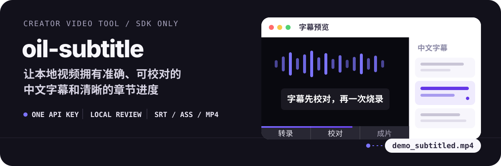
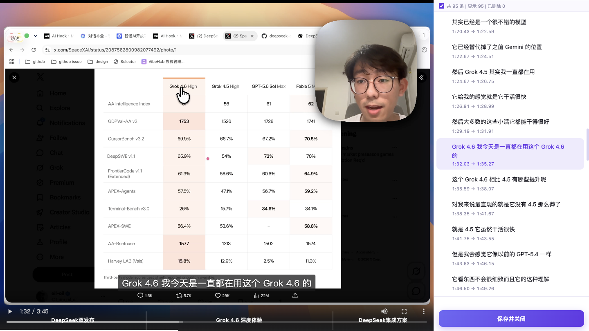

# oil-subtitle

<p align="center">
  
</p>

把已经导出的 MP4、MOV 交给 Agent，依次完成转录、术语纠错、人工预览、章节生成和 FFmpeg 烧录。默认只生成中文字幕，只需要一个百炼 API Key。

[快速开始](#快速开始) · [工作流程](#工作流程) · [维护词库](#维护-hotwords-与-glossary) · [数据边界](#数据边界)

## 效果预览

<p align="center">
  
</p>

左侧实时预览字幕和章节进度，右侧逐句修改、删除或批量查找替换，确认后点击「保存并关闭」即可继续烧录。

保存时会自动比较人工修改，并用 `qwen3.7-flash` 判断哪些属于以后还会遇到的 ASR 错词。只有高置信、安全且不冲突的映射进入个人错题本；润色、删句和标点修改不会污染词库。

## 最终会得到什么

一次完整处理会保留可追溯的中间结果，并交付可继续修改的字幕文件和成片：

```text
demo.subtitle-work/
├── bailian_asr.json             # 原始 ASR 响应
├── transcript.json              # ASR、术语校正并分行后的转录稿
├── reviewed-transcript.json     # 语义与视觉校对后的转录稿
├── subtitle-review.json         # 已确认和待人工确认的疑点报告
├── review-frames/               # 疑点时间附近的验证帧
├── subtitle-transcript.json     # 人工预览后保存的字幕
├── manual-edit-review.json      # 人工修改的学习、忽略与冲突记录
├── subtitle-chapters.json       # 长视频章节
└── subtitle-manifest.json       # 本地预览入口

demo_subtitled.srt
demo_subtitled.ass
demo_subtitled.mp4
```

## 工作流程

1. 用 FFmpeg 从本地视频提取单声道音频。
2. 通过 DashScope Python SDK 调用百炼 FunAudio ASR，保留原始识别结果和词级时间戳。
3. 在识别阶段应用 hotwords，再用 glossary 修正常见误识别。
4. 用 `qwen3.7-flash` 做语义校对；遇到型号、版本号、命令、文件名或界面文字时，自动抽取对应时间附近的三帧，再用同一模型视觉核对。看不清的内容保留给用户确认，不凭模型知识猜测。
5. 用 Qwen 完成字幕级断句；章节进度默认开启，视频严格超过 3 分钟时，同时根据字幕生成 2–6 个宽粒度章节，并在视频画面底部以半透明渐变阴影展示进度。
6. 启动本地字幕编辑器，由用户检查脚本未能确认的内容，并按需修改或删除字幕。
7. 保存时自动提取人工修改，由 `qwen3.7-flash` 判断是否加入个人 glossary，并生成可追溯的判断报告。
8. 生成 SRT、ASS，并用 FFmpeg 一次烧录成片。

正常烧录还会检测持续出现的人脸区域并执行固定轻度美颜；需要保留原画时使用 `--no-beauty`。

## 快速开始

运行环境：macOS、Python 3、Homebrew。`setup.sh` 会准备独立虚拟环境，并在缺少 FFmpeg 时通过 Homebrew 安装。

```bash
SKILL_DIR="/absolute/path/to/oil-subtitle"

bash "$SKILL_DIR/setup.sh"
"$SKILL_DIR/.venv/bin/python3" \
  "$SKILL_DIR/scripts/configure_api_key.py"
```

配置完成后，把视频路径和目标告诉 Agent：

```text
给 /path/to/demo.mp4 加中文字幕，先让我校对，再烧录成片。
```

Agent 的完整执行规范见 [SKILL.md](SKILL.md)。

不想显示章节进度条时，直接告诉 Agent“这次关闭章节进度条”即可；Agent 会跳过章节生成并在烧录时关闭进度条，不需要手动修改配置。需要重新开启时说“开启章节进度条”。

## API Key 只需配置一次

FunAudio ASR、Qwen 字幕断句、章节生成和 hotwords 共用同一个百炼 API Key，全部通过 DashScope Python SDK 调用，不需要安装百炼 CLI、Node.js，也不依赖 ZenMux。

默认保存位置：

```text
~/.config/oil-subtitle/dashscope_api_key
```

文件权限固定为 `600`。后续运行会自动读取，无需重复输入。读取优先级为：

1. 当前环境中的 `DASHSCOPE_API_KEY`；
2. 本地 API Key 文件；
3. 旧的 `~/.bailian/config.json`。

如果以前执行过 `bl auth login`，`setup.sh` 会尝试把旧凭据迁移到新位置。

## 维护 hotwords 与 glossary

词库全部使用普通 JSON 文件，放在用户自己的配置目录，不必修改 Skill 代码，也不要把个人词库或 API Key 提交进仓库。个人 glossary 默认保存在 `~/.config/oil-subtitle/glossary.json`；只有希望换位置时才需要在配置中填写 `glossary`。

`hotwords.json` 在 ASR 识别阶段提高产品名、英文缩写和人名的命中率：

```json
[
  { "text": "Claude Code", "weight": 4, "lang": "en" },
  { "text": "百炼", "weight": 4, "lang": "zh" }
]
```

`glossary.json` 在识别完成后执行确定性替换，适合修正已经反复出现的错字：

```json
[
  { "wrong": "Claude Core", "correct": "Claude Code" },
  { "wrong": "白练", "correct": "百炼" }
]
```

在 `~/.config/oil-subtitle/config.json` 中指向这两个文件：

```json
{
  "hotwords": "~/.config/oil-subtitle/hotwords.json",
  "glossary": "~/.config/oil-subtitle/glossary.json",
  "subtitles": {
    "progress_enabled": true,
    "progress_min_duration_seconds": 180
  }
}
```

预览页保存后，脚本会固定比较修改前后的字幕，并用 `qwen3.7-flash` 逐项判断。只有置信度至少为 `0.97`、来自原句连续子串、保留必要上下文且不与已有规则冲突的错词映射才会自动追加；一次性改写、删句、标点调整和无法确认的修改会记录在 `manual-edit-review.json`，但不会进入词库。hotwords 内容变化后，脚本会自动更新远程词表缓存。

## 手动运行

如果不通过 Agent，也可以直接执行各阶段脚本。下面是主流程中的核心命令：

```bash
SKILL_DIR="/absolute/path/to/oil-subtitle"
VIDEO="/path/to/demo.mp4"
WORK="/path/to/demo.subtitle-work"
mkdir -p "$WORK"

"$SKILL_DIR/.venv/bin/python3" "$SKILL_DIR/scripts/bailian_transcribe.py" \
  "$VIDEO" \
  --output "$WORK/transcript.json" \
  --raw-output "$WORK/bailian_asr.json" \
  --language zh

"$SKILL_DIR/.venv/bin/python3" "$SKILL_DIR/scripts/review_subtitles.py" \
  --video "$VIDEO" \
  --transcript "$WORK/transcript.json" \
  --output "$WORK/reviewed-transcript.json" \
  --report "$WORK/subtitle-review.json" \
  --frames-dir "$WORK/review-frames"

"$SKILL_DIR/.venv/bin/python3" "$SKILL_DIR/scripts/prepare_subtitles.py" \
  --transcript "$WORK/reviewed-transcript.json" \
  --video "$VIDEO" \
  --output "$WORK/subtitle-transcript.json" \
  --chapters-output "$WORK/subtitle-chapters.json" \
  --manifest-output "$WORK/subtitle-manifest.json" \
  --work-dir "$WORK/cache" \
  --resume
```

预览、草稿检查和最终烧录命令见 [SKILL.md](SKILL.md)。

## 适用边界

- 只处理已经导出的本地视频，不修改 `.screenstudio` 工程时间线。
- 默认远程转录；本地 Whisper 只作为明确指定的降级或对比路径。
- 默认只生成中文字幕，不生成双语字幕。
- 章节进度默认开启，但只在视频严格超过 3 分钟时显示；可直接让 Agent 为当前任务关闭。
- 预览服务只在本机启动；端口默认是 `8765`。

## 数据边界

- 远程转录会把从视频提取的音频上传到百炼临时存储。
- 字幕断句和章节生成会把对应的字幕文本发送给百炼 Qwen。
- 用户保存预览修改后，修改前后的相关字幕片段会发送给百炼 Qwen，用于判断是否加入个人错题本。
- API Key、个人配置和词库保存在用户目录，不应进入仓库。
- 预览界面、人工编辑、判断报告、个人词库写入、SRT/ASS 生成和 FFmpeg 烧录都在本机完成。

## 脚本索引

| 脚本 | 作用 |
| --- | --- |
| `scripts/configure_api_key.py` | 一次性保存或迁移百炼 API Key |
| `scripts/bailian_transcribe.py` | FunAudio ASR、hotwords、glossary 和字幕分行 |
| `scripts/review_subtitles.py` | Qwen 语义校对、疑点检测、按需抽帧和视觉核对 |
| `scripts/local_transcribe.py` | 本地 Whisper 降级转录 |
| `scripts/prepare_subtitles.py` | 准备中文字幕、章节和预览 manifest |
| `scripts/preview_editor.py` | 启动本地字幕预览编辑器 |
| `scripts/learn_glossary.py` | 从人工修改中判断并学习可复用的 ASR 错词 |
| `scripts/burn_subtitles.py` | 生成 SRT/ASS 并烧录 MP4 |

## 测试

```bash
./.venv/bin/python3 -m unittest discover -s tests
```
